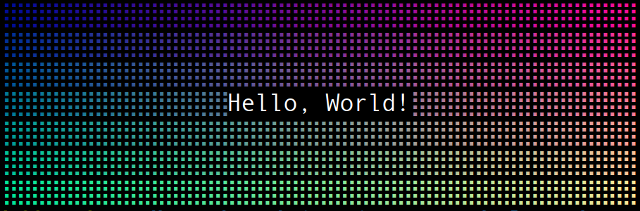
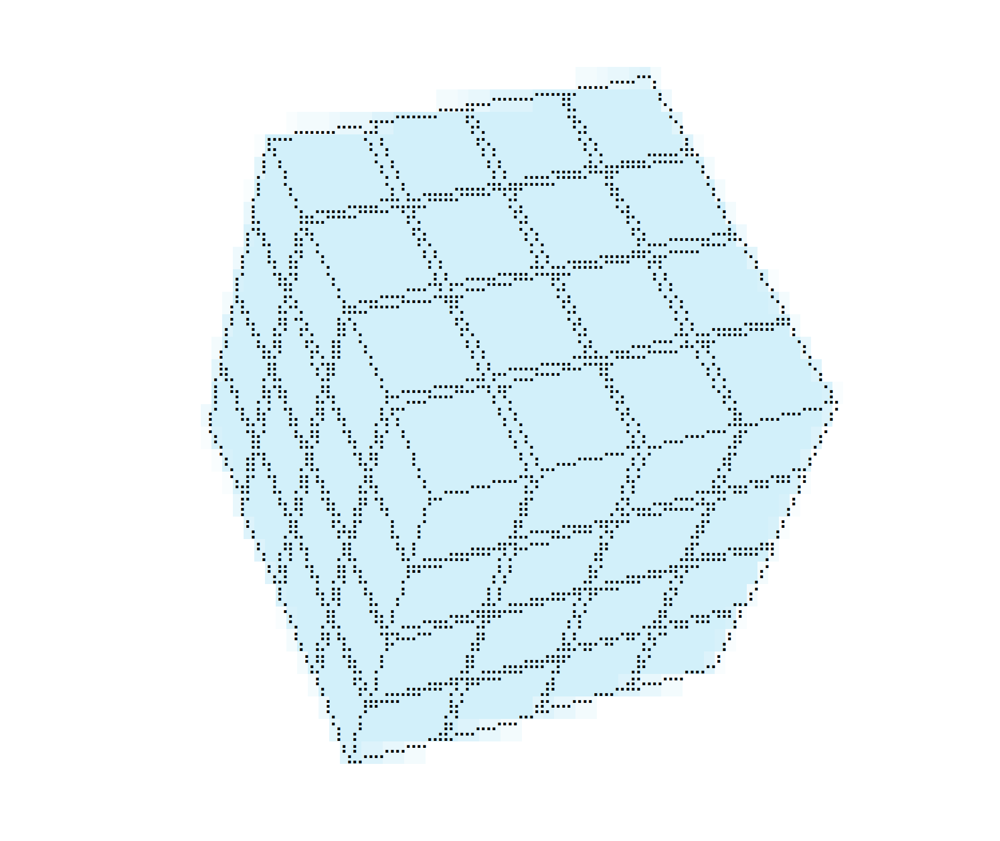

# consolecanvas-next



A versatile collection of drawing canvases for console and terminal environments. Features multiple rendering styles and color modes with web canvas API compatibility. Supports both Unicode block characters and Braille patterns (similar to drawille) for high-resolution terminal graphics.

Heavily inspired and in part derived from [drawille](https://www.npmjs.com/package/drawille).

**Key Features:**
- Web Canvas API compatibility
- Unicode block and Braille rendering modes
- Multiple color schemes
- Cross-platform terminal support
- Enhanced functionality beyond drawille

## Usage

```bash
yarn install # 1 Install dependencies
yarn build   # 2 Build package and demos
yarn demo    # 3 Show demo
```

## Canvas Classes

* **FastCanvas** - most basic canvas that supports up to 256 colors, drawille style.
* **SmoothCanvas** - Supports truecolor and color mixing, drawille style.
* **BlockCanvas** - Supports truecolor and color mixing, unicode block style.

## Color Modes

* **ColorMode.ANSI16** - restricted to the first 16 ANSI colors. If you use rgb while drawing, tries to fit to these colors, but don't expect too good results (esp. when you manually changed your terminal colors).
* **ColorMode.ANSI256** - uses truecolor emulation in 256 ANSI colors.
* **ColorMode.TRUECOLOR** - full truecolor mode.

## Drawing modes

The foreground and background are handled differently in the console, and therefore there are different modes for drawing in the foreground or background of the canvas.

* **DrawMode.FOREGROUND** - Draws only in the foreground for stroke and fill. (**default**)
* **DrawMode.BACKGROUND** - Draws only in the background for stroke and fill.
* **DrawMode.BOTH** - Draw in the forground and background with both stroke and fill.
* **DrawMode.FILLBG_STROKEFG** - Draw strokes in the foreground and fills in the background. Additionally filling will also remove foreground pixels.

## Example

Example for **DrawMode.FILLBG_STROKEFG**: The fill for the surfaces is a light blue that goes to the background. The edges of thesirfaces are stroked to the foreground with black. Truecolor SmoothCanvas.



